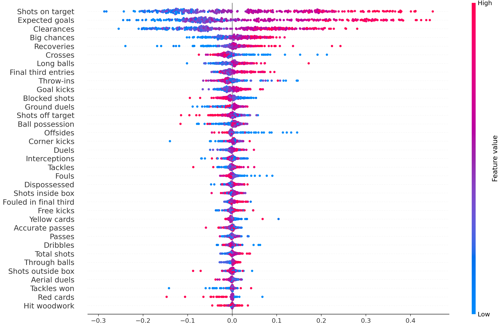
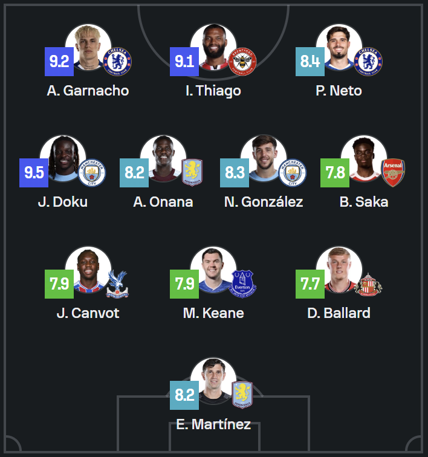

## Important Stats ML:

This is a really simple machine learning project, exploring the "feature_importance" and SHAP explainer capabilities. The general premise was to determine what are the first things you should look at when deciding what team deserved to win a football match.

The model is trained on all match data from the premier league since the 2022/23 season as this was when xG started being introduced on SofaScore. In order to reduce the number of features, I measured the difference between stats from each team, effectively halving the number of features. For example, if one team had 5 shots on target and the other team had 7, the category would show -2, and I wouldn't need to have the value for both teams. Since taking the difference varies depending on the order of the operation, I decided to always have the home team as the one being subtracted from. This created a different problem which is that there could possibly be a home team bias built into the model. To fix this, I made it so that the program randomly flips all the signs of statistics for 50% of the matches.

After running the model, it produces the list of importance scores:
```
                  Feature  Importance
10        Shots on target    0.092230
1          Expected goals    0.084038
31             Clearances    0.046692
2             Big chances    0.039432
11           Hit woodwork    0.035946
23                Crosses    0.031785
20              Throw-ins    0.027354
22             Long balls    0.026835
26           Ground duels    0.026349
8              Free kicks    0.025938
32             Goal kicks    0.025730
3             Total shots    0.025247
14       Shots inside box    0.024777
12       Shots off target    0.024774
21    Final third entries    0.024588
29            Tackles won    0.024530
24                  Duels    0.024413
19        Accurate passes    0.024364
13          Blocked shots    0.023739
25           Dispossessed    0.023726
34             Recoveries    0.023714
6                  Passes    0.023060
28               Dribbles    0.023027
7                 Tackles    0.022621
4            Corner kicks    0.022559
27           Aerial duels    0.022060
5                   Fouls    0.021870
0         Ball possession    0.021840
15      Shots outside box    0.021447
33              Red cards    0.020942
16          Through balls    0.020535
17  Fouled in final third    0.019113
30          Interceptions    0.018576
9            Yellow cards    0.018238
18               Offsides    0.017912
```

And the SHAP explainer plot (the x axis is the change in win probability due to that feature value):


Some of these results are very expected (Shots on target, expected goals, etc.), but others are more interesting. For example, clearances are judged as being very important, and crosses are seen as having a negative effect on win probability.

## Estimate Position:

This program estimates the position of a player based on their single-match stats and average match position. It then does this for the entire team and uses the positional probabilities to calculate the team's most likely formation. It returns a list like this:

```
Manchester City:

Most likely formations:
4-4-1-1 (2): likelihood = 0.00534
4-2-3-1: likelihood = 0.0037
4-4-1-1: likelihood = 0.0034
4-3-3 (2): likelihood = 0.00236
4-1-4-1: likelihood = 0.00176

Optimal player-to-position mapping for Manchester City:

Player 1 (Kyle Walker) → RB (0.6291)
Player 2 (Rúben Dias) → CB (0.9796)
Player 3 (Nathan Aké) → LB (0.6334)
Player 4 (Rodri) → DM (0.6165)
Player 5 (Manuel Akanji) → CB (0.5811)
Player 6 (Phil Foden) → RM (0.2928)
Player 7 (Julián Alvarez) → AM (0.5350)
Player 8 (Bernardo Silva) → DM (0.3644)
Player 9 (Jérémy Doku) → LM (0.7209)
Player 10 (Erling Haaland) → ST (0.9274)

Liverpool:

Most likely formations:
4-3-3 (2): likelihood = 0.00708
4-3-3: likelihood = 0.00575
4-1-4-1 (2): likelihood = 0.0032
4-2-3-1: likelihood = 0.0032
4-3-3 (3): likelihood = 0.0018

Optimal player-to-position mapping for Liverpool:

Player 1 (Trent Alexander-Arnold) → RB (0.7073)
Player 2 (Joël Matip) → CB (0.9742)
Player 3 (Virgil van Dijk) → CB (0.9948)
Player 4 (Konstantinos Tsimikas) → LB (0.8309)
Player 5 (Dominik Szoboszlai) → AM (0.3666)
Player 6 (Alexis Mac Allister) → CM (0.5348)
Player 7 (Curtis Jones) → CM (0.2698)
Player 8 (Mohamed Salah) → RW (0.6801)
Player 9 (Darwin Núñez) → ST (0.9752)
Player 10 (Diogo Jota) → LW (0.3542)
```

It then asks the user if they want to see the position probabilities for a specific player:

```
Probabilities for Player Kyle Walker:
Position  Probability
      RB       0.6291
      CB       0.3471
      RM       0.0177
      DM       0.0021
      CM       0.0015
      AM       0.0007
      RW       0.0007
      LB       0.0005
      LM       0.0002
      LW       0.0002
      ST       0.0002
```

I've found that the program generally produces good results for the individual player position probabilities, but I need to find a better way to find the most likely formations as that is quite often wrong.

## Improved Team of the Week:

I made this program because I noticed that most of the time people make a "team of the week" of the best players from a matchweek, the formations and positions of players are very unrealistic (strikers on the wing, wingers at fullback, etc.).

The program uses the same predictive model as the estimate position program to determine positional probability distributions. It applies the model to all of the player performances from the week, and then picks multiple players with the highest ratings from each position. It then takes the 35 selected players and works out all the probabilities of most likely formations with every combination of players, and multiplies them by the product of the players' ratings to get the team score. This means that the only way it would choose a really wacky formation is if the average player ratings are significantly higher because of it. It uses matrices to efficiently calculate the probabilities, so it runs very quickly.

Below is an example of the output:

```
Formation: 4-2-4 (2)

Strikers:
Igor Thiago (Rating: 9.1) (Positional Fit: 82.52)
Callum Wilson (Rating: 7.6) (Positional Fit: 98.73)

Left Wingers:
Jérémy Doku (Rating: 9.5) (Positional Fit: 74.01)

Right Wingers:
Pedro Neto (Rating: 8.4) (Positional Fit: 62.52)

Defensive Midfielders:
Nico González (Rating: 8.3) (Positional Fit: 62.24)
Amadou Onana (Rating: 8.2) (Positional Fit: 48.92)

Left Backs:
Tyrick Mitchell (Rating: 7.8) (Positional Fit: 84.04)

Center Backs:
Michael Keane (Rating: 7.9) (Positional Fit: 94.44)
Jaydee Canvot (Rating: 7.9) (Positional Fit: 90.68)

Right Backs:
Matheus Nunes (Rating: 7.7) (Positional Fit: 86.14)

Goalkeeper:
Emiliano Martínez (Rating: 8.2)
```

And here is SofaScore's team of the week for the same matchday:


As you can see, SofaScore's version is trying to fit as many high-rating players into the lineup as possible, leading to the formation having 4 wingers, which is not realistic. While my version has a lower average rating, the formation is much more believable.

Something I could possibly change is that I could make an option to do a "team of the season" using players' average ratings over the season and their average positional probabilities.
